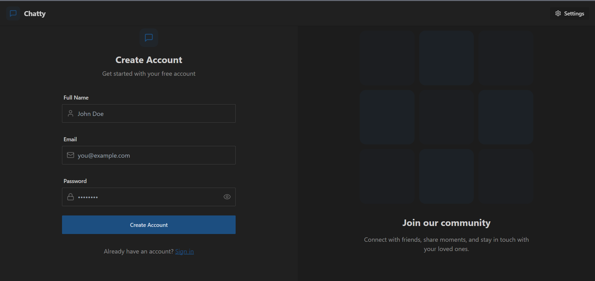
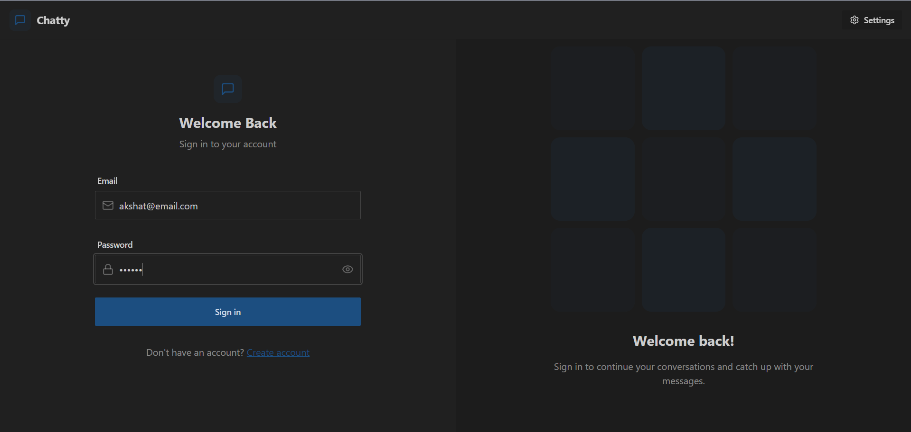
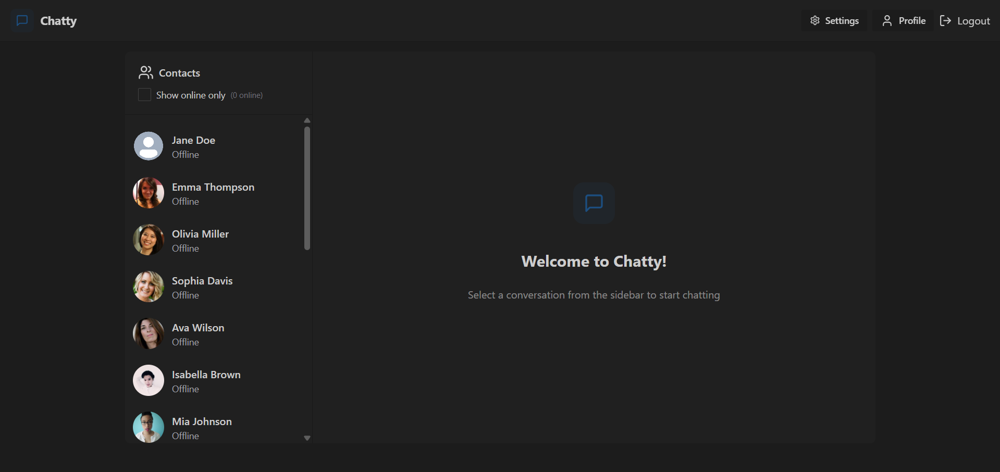
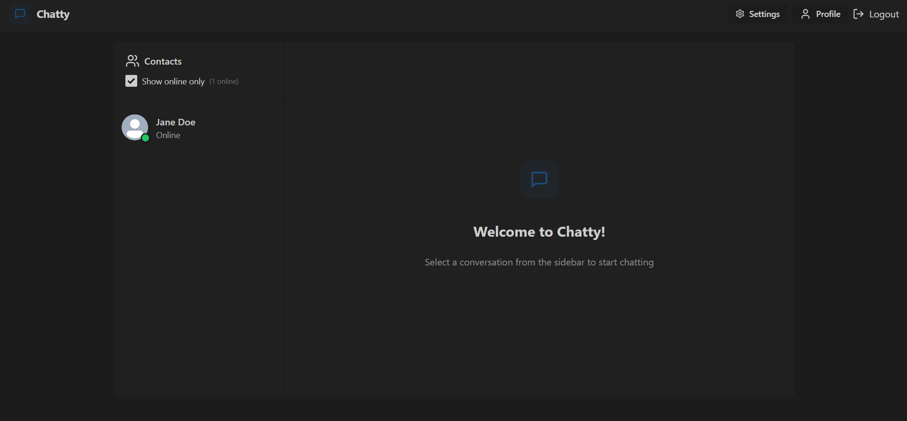
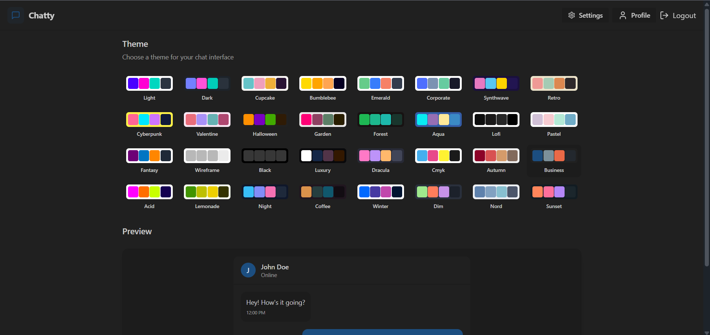
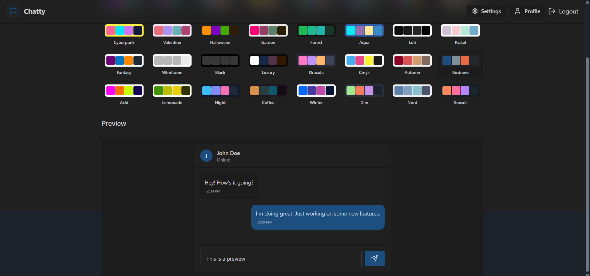
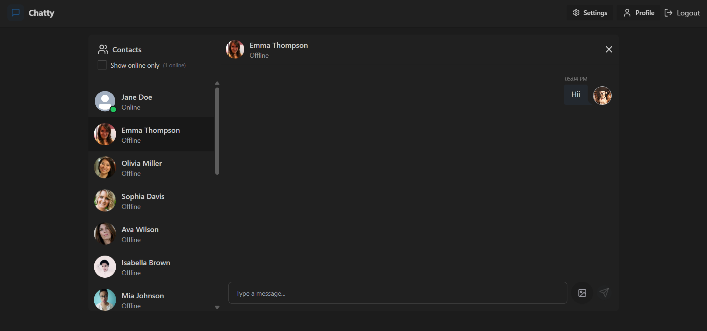
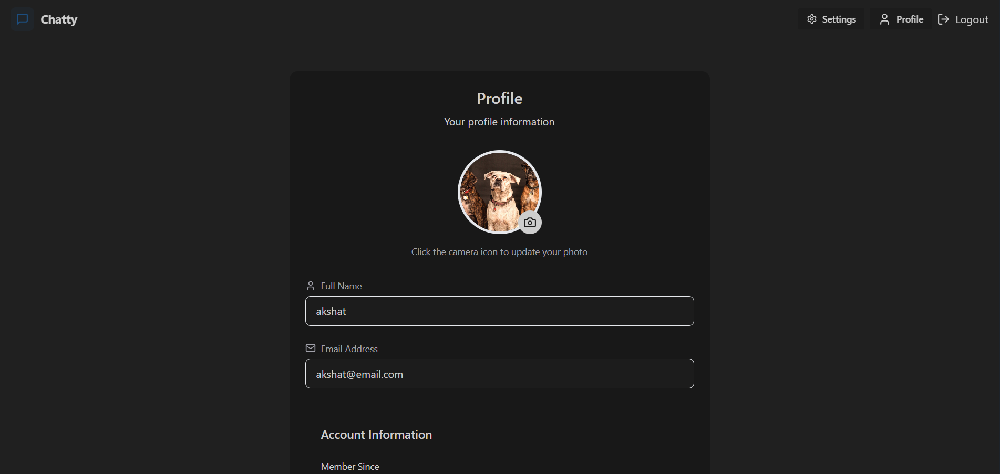

# **Real-Time Fullstack Chat Application**

“Connecting people with instant real-time conversations.”

 

## 🎯 **About This Project**

This is a **fullstack real-time chat application** where users can:

✅ Sign up & log in securely  
💬 Chat instantly with anyone online  
📸 Update their profile picture anytime  
🔒 Log out securely with JWT authentication  
⚡ Experience **blazing-fast messaging** with Socket.IO  
🎨 Choose from **32+ different colour themes** for UI customisation

---
 

## 🌟 **Tech Stack & Their Roles**

### **Frontend -**
-   
  ➔ *Builds dynamic UI components efficiently.*
  
-   
  ➔ *Provides utility-first CSS for fast responsive design.*

-   
  ➔ *Manages global state for user authentication and chat data.*

-   
  ➔ *Offers pre-styled UI components with support for **32+ colour themes**.*

### **Backend -**
-   
  ➔ *Runs the backend server using JavaScript.*

-   
  ➔ *Handles API routes and server middleware.*

### **Database -**
-   
  ➔ *Stores user data and chat messages persistently.*

### **Others -**
-   
  ➔ *Enables real-time messaging between users.*

-   
  ➔ *Stores and delivers profile pictures efficiently.*

---
 

## ✨ **Features**

- ⚡ **Real-time messaging** with Socket.IO  
- 🔑 **JWT Authentication** for secure login & protected routes  
- 🖼️ **Profile picture uploads** using Cloudinary  
- 🎨 **32+ UI themes** with Daisy UI  
- 💻 **Responsive and clean UI** with Tailwind CSS  
- 🔌 **Fast state management** with Zustand

---
 

## 🔧 **Screenshot**

### 🔻 Create Account Page

  

 

### 🔻 Login Page

  

 

### 🔻 Dashboard Page

  
  

 

### 🔻 Settings Page

  
  

 

### 🔻 Chat Page

  

 

### 🔻 Profile Update Page

  
  

